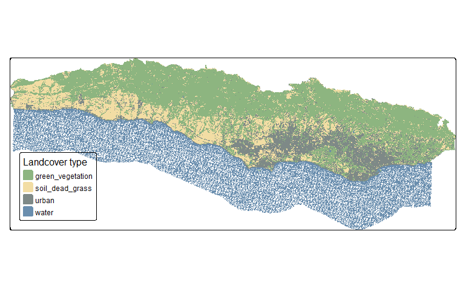

# Land Cover Classification in Santa Barbara: A Decision Tree Approach

## Overview

This project focuses on classifying land cover in southern Santa Barbara County using a decision tree classifier applied to Landsat 5 Thematic Mapper imagery. The classification aims to identify four primary land cover types: green vegetation, soil/dead grass, urban areas, and water bodies. This approach provides insights into the distribution and dynamics of land cover, crucial for understanding environmental changes and urbanization impacts. 

## Data

- **Landsat 5 Thematic Mapper Imagery**: Multi-spectral imagery from September 25, 2007, including bands 1, 2, 3, 4, 5, and 7.
- **Study Area and Training Data**: Spatial data representing Southern Santa Barbara County and specific locations tagged with one of the four land cover types.

The dataset associated with this project is too large for direct inclusion in this GitHub repository. Please download the data from the provided [Google Drive link](https://drive.google.com/drive/folders/1ON8FbDqcTjg2PKHmNGgyN7odTqpOnXla) to replicate the analysis. Unzip the folder and all the contents and store in your directory as follows.

```         
Land_Cover_Classification_in_Santa_Barbara
│   .gitignore
│   README.md
│   Rmd/Proj files 
│
└───Report
    │   Land_Cover_Classification_in_Santa_Barbara.html
    │   Classification_result.jpeg
│
└───data
    │   SB_county_south.shp
    │   SB_validation_points_shp
    |   trainingdata.shp
    │   landsat-data
        │   LT05_L2SP_042036_20070925_20200829_02_T1_SR_B1.TIF
        │   LT05_L2SP_042036_20070925_20200829_02_T1_SR_B2.TIF
        │   LT05_L2SP_042036_20070925_20200829_02_T1_SR_B3.TIF
        │   LT05_L2SP_042036_20070925_20200829_02_T1_SR_B4.TIF
        │   LT05_L2SP_042036_20070925_20200829_02_T1_SR_B5.TIF
        │   LT05_L2SP_042036_20070925_20200829_02_T1_SR_B7.TIF
                
```


## Getting Started

1. **Clone the Repository**: Clone or download this repository to your local computer.
2. **Date Setup**: Download the data from the above link and place it in the `data` directory.
3. **Run the Analysis**: Open the R Markdown files in the `Rmd/Proj files` directory to view and run the analysis. Ensure you have installed all necessary R packages.


## Analysis Overview

The R Markdown files contain a detailed breakdown of the analysis process, including:

1. **Data Preparation**: Loading and processing Landsat 5 imagery.
2. **Study Area Definition**: Defining and masking the study area.
3. **Reflectance Conversion**: Adjusting Landsat values to reflectance.
4. **Training Data Extraction**: Extracting spectral data for land cover types.
5. **Decision Tree Training**: Implementing the decision tree classifier.
6. **Classification and Visualization**: Applying the classifier and visualizing results.

## Classification Result
Visualization of the land cover classification 

